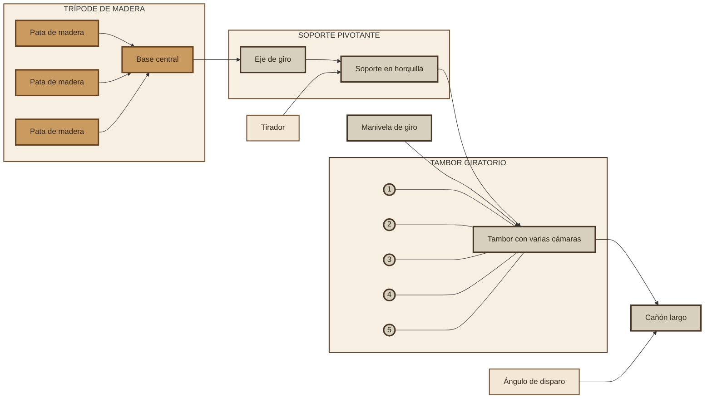

# Diagramas de la patente «Defence Gun»

Proyecto dedicado a representar el diseño de la patente del **«Defence Gun»**, un arma de fuego de repetición patentada por **James Puckle en 1718**. La documentación presenta el mismo concepto mediante tres tipos de diagrama: **SVG**, **Excalidraw** y **Mermaid**.

## Objetivo

Mostrar de forma visual y comparable los principales elementos descritos en la patente:

- el cañón y su soporte;
- el cilindro giratorio con varias cámaras;
- el mecanismo de rotación y carga;
- la posición del tirador y la orientación del arma;
- la secuencia general de funcionamiento.

Los diagramas tienen un propósito **histórico y educativo**. Son representaciones esquemáticas de la patente y no deben interpretarse como planos de fabricación ni como una reproducción exacta de un arma histórica.

## Versiones del diagrama

### SVG

Ilustración vectorial del arma y de sus componentes principales. Este formato permite conservar la nitidez al ampliar la imagen y facilita su visualización directamente en un navegador.

Archivo: [defenseGun.svg](defenseGun.svg)

### Excalidraw

Diagrama editable con un estilo de pizarra. La versión de Excalidraw permite reorganizar los elementos, añadir anotaciones y explicar visualmente la relación entre las distintas partes del mecanismo.

Archivo: [defenseGun.excalidraw](defenseGun.excalidraw)

### Mermaid

Esquema de los componentes principales —cañón largo, tambor de varias cámaras, manivela, soporte pivotante y trípode de madera— junto con un ciclo simplificado. La paleta sepia evoca un grabado técnico histórico; la disposición es conceptual y no está a escala:

Archivo: [defenseGun.mmd](defenseGun.mmd)



### Vídeo vertical: Defence Gun, 1718

Video animado vertical de aproximadamente un minuto, sincronizado con la narración en [docs/Audio.aac](docs/Audio.aac). Presenta la patente de James Puckle, el concepto del cilindro giratorio y el contexto histórico de la propuesta. Es una explicación educativa, no un plano de fabricación.

Proyecto Remotion: [puckle-vertical-video](puckle-vertical-video/)

Para abrir la vista previa:

```bash
cd puckle-vertical-video
npm run dev
```

En Remotion Studio, selecciona `PuckleVertical`. Las instrucciones para exportar el MP4 están en el [README del proyecto de vídeo](puckle-vertical-video/README.md).

## Contexto histórico

En 1718, James Puckle registró una patente para un arma montada sobre un soporte y equipada con un cilindro rotatorio. La intención era permitir varios disparos sucesivos sin recargar el cañón después de cada tiro. La patente también distinguía entre diferentes tipos de munición, incluida una propuesta de proyectil cuadrado destinada a emplearse contra determinados enemigos.

El proyecto se centra en la **estructura y el funcionamiento representado en la patente**, sin presentar el diseño como un arma moderna ni validar sus afirmaciones históricas o militares.

## Estructura prevista

```text
.
├── README.md
├── defenseGun.svg
├── defenseGun.excalidraw
├── defenseGun.mmd
├── docs/
│   ├── Audio.aac
│   └── guion-defense-gun.md
└── puckle-vertical-video/
    ├── package.json
    ├── package-lock.json
    ├── README.md
    ├── public/
    └── src/
```

## Visualización y edición

- El archivo `.svg` puede abrirse en cualquier navegador moderno.
- El archivo `.excalidraw` puede editarse en [Excalidraw](https://excalidraw.com/) o mediante una aplicación compatible.
- El archivo `.mmd` puede renderizarse con [Mermaid Live Editor](https://mermaid.live/) o con cualquier herramienta compatible con Mermaid.

## Alcance

Este repositorio reúne una interpretación gráfica de una patente histórica. Las ilustraciones simplifican algunos detalles para favorecer la lectura y no sustituyen la consulta del documento original ni de fuentes especializadas.